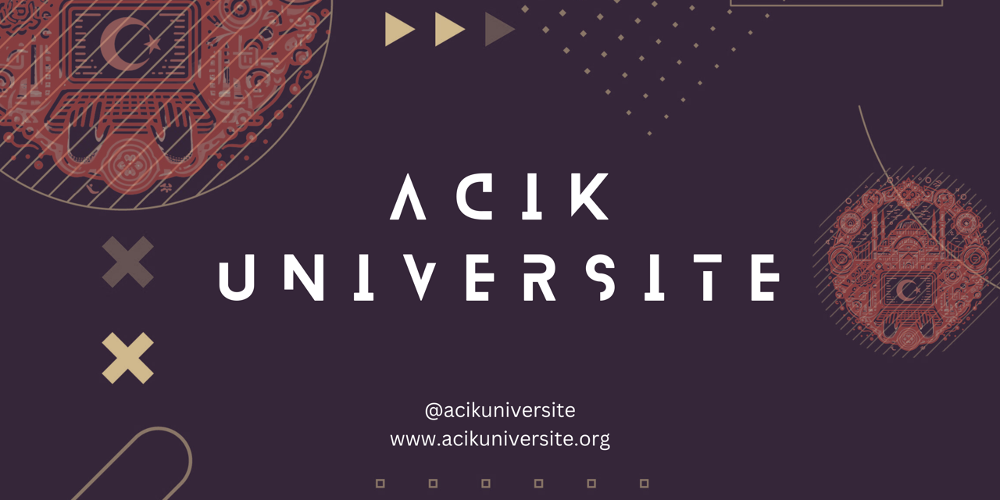

## 📚 Açık Üniversite Nedir?
Açık Üniversite, herkesin ücretsiz ve erişilebilir eğitim materyallerine ulaşmasını hedefleyen bir platformdur. Misyonumuz, yüksek kaliteli eğitimi herkese ulaştırmak ve hayat boyu öğrenme fırsatları sunmaktır. Vizyonumuz, Türkiye'de ve dünyada açık kaynak eğitim materyalleri ile eğitimde eşitliği sağlamaktır.

### Dönemler
- **Yaz Kampı 2024 (Tamamlandı)**
- [Güz Dönemi 2025 (Son Kayıt 30 Ekim)](./guz25.md)

### Kurslar
Gereksinim duymadan başlayabileceğiniz dersler:

- ✅ Daha önceden işlenmiş ve kaydı bulunan dersler.
- 🔜 Yakın zamanda aktif olacak dersler.
- 🕞:Planlaması henüz yapılmamış dersler
#### Tilki Seviye 🦊 (Başlangıç)

| Kod         | Kurs Adı                                                           | Açıklama                                                                                                       | Yaz24 | Güz25 |
| ----------- | ------------------------------------------------------------------ | -------------------------------------------------------------------------------------------------------------- | ----- | ----- |
| go101       | [Go Programlama](https://acikuniversite.org/go101)                 | Go programlama dilini öğrenin.                                                                                 | ✅     | 🔜    |
| cs101       | [Bilgisayar Bilimlerine Giriş](https://acikuniversite.org/cs101)   | Bilgisayar bilimlerine genel bir giriş yapın.                                                                  | ✅     | 🔜    |
| web101      | [Web Geliştirme](https://acikuniversite.org/web101)                | Web geliştirme temellerini öğrenin.                                                                            | ✅     | 🔜    |
| py101       | [Python Programlama](https://acikuniversite.org/py101)             | Python programlama dilini öğrenin.                                                                             | 🕞    | 🕞    |
| linux101    | [Linux Temelleri](https://acikuniversite.org/linux101)             | Linux işletim sistemi temellerini öğrenin.                                                                     | 🕞    | 🕞    |
| algo101     | [Algoritma ve Veri Yapıları](https://acikuniversite.org/algo101)   | Algoritmalar ve veri yapıları hakkında bilgi edinin.                                                           | 🕞    | 🕞    |
| android101  | [Mobil Uygulama Geliştirme](https://acikuniversite.org/android101) | Android uygulama geliştirme temellerini öğrenin.                                                               | 🕞    | 🕞    |
| data101     | Veri ve Veritabanı Mimarisi                                        | Veri bilimi hakkında temelleri öğreneceğiniz ve Veritabanları üzerine yetkinlik kazanacağınız özel ders serisi | 🕞    | 🔜    |
| dataeng101  | Veri Mühendisliğine Giriş                                          |                                                                                                                | 🕞    | 🕞    |
| WebDesign"H | Web Tasarım (Hanımlara Özel)                                       | Web geliştirme temellerini öğrenin.                                                                            | 🕞    | 🔜    |
| UI/UX101    |                                                                    |                                                                                                                | 🕞    | 🕞    |

#### Baykuş Seviye 🦉 (Orta)

| Kod     | Kurs Adı                                                  | Açıklama                                               | Gereklilik | Yayında mı? |
| ------- | --------------------------------------------------------- | ------------------------------------------------------ | ---------- | ----------- |
| go201   | [Go Programlama 201](https://acikuniversite.org/go201)    | Go programlama dilinde ileri seviye konuları öğrenin.  | go101      | ✅           |
| ai101   | [AI & Machine Learning](https://acikuniversite.org/ai101) | Yapay zeka ve makine öğrenmesi temellerini öğrenin.    | py101      | ❌           |
| web201  | [Web Geliştirme 201](https://acikuniversite.org/web201)   | Web geliştirme alanında ileri seviye konuları öğrenin. | web101     | ❌           |
| data201 | [Veri Bilimi](https://acikuniversite.org/data101)         | Veri bilimi temellerini öğrenin.                       | py101      | ❌           |

#### Kartal Seviye 🦅 (İleri)

| Kod | Kurs Adı | Açıklama | Gereklilik | Yayında mı?|
|-----|---------|---------|------------|------------|
|go301|[Go Programlama 301](./go301)| Go programlama dilinde ileri seviye konuları öğrenin.|  go201 | ❌ |
|ai201|[AI & Machine Learning 201](./ai201)| Yapay zeka ve makine öğrenmesi alanında ileri seviye konuları öğrenin. | ai101 | ❌ |
|data201|[Veri Bilimi 201](./data201)| Veri bilimi alanında ileri seviye konuları öğrenin. | data101 | ❌ |

## Neden Açık Üniversite? 🤔

### 📝 Git Based Sertifika ve Referans Sistemi
- Proje tabanlı öğrenme ve değerlendirme sistemi.
- GitHub üzerinde projelerinizi sergileyerek, onaylanmış ve değerlendirilmiş projeler ile acikuniversite.org üzerinde sertifika alabilirsiniz.
- İş başvurularında kullanılabilecek referans QR kodu ile sertifikalarınızı doğrulayabilirsiniz.

### 📚 İleri Öğrenme ve Öğretme İmkanları
- Türkçeleştirilmiş, açık kaynak eğitim materyalleri.
- Gündemdeki teknolojiler ve konular hakkında güncel kaynakların takibi ve çevirileri.
- Eğitmenlik, koçluk ve birebir mentorluk imkanları.
- Topluluk içinde projeler ve etkinliklerle pratik tecrübe kazanma.
- İleri seviye eğitimler ve projelerle kariyer gelişimine destek.

### 🛡️ Güvenilir Topluluk
- Mezun ve katılımcıların, kendi fikirleri ve hayallerini paylaşabileceği güvenli, mill ve manevi değerlere saygılı bir topluluk.
- Eğitim sürecinde ve sonrasında destek ve rehberlik sağlayan bir ağ.
- İş arayış ve Çalışan arayışlarında destek ve referans olabilecek bir topluluk.
- İnovatif projeler ve girişimlerde işbirliği ve destek sağlayan bir ağ.
- Zararlı ve olumsuz durumlara karşı koruyucu ve önleyici tedbirler alan bir topluluk.

## Ekip Yapımız 🤝

### 🧑‍🏫 Eğitmenler ve Koçlar

Aktif eğitim sürecinde, eğitmenler ve koçlar ders içeriklerini hazırlamak ve sunmakla sorumludur. Eğitmenler, ders içeriklerini hazırlar ve sunarlar. Koçlar ise eğitmenlere destek sağlar ve öğrencilere birebir yardım sunarlar.

- **Eğitmenler:** Ders içeriklerini hazırlayan ve sunan uzmanlar.
- **Koçlar:** Eğitmenlere destek sağlayan ve öğrencilere birebir yardım sunan yardımcı eğitmenler.

### 🛠️ Arge Ekibi

Arge ekibi, eğitim platformunu geliştirmek ve yeni teknolojileri entegre etmekle sorumludur. Ayrıca, yeni eğitim materyalleri ve metodolojileri geliştirmekle de ilgilenirler. Deneysel çalışmaların ve Açık Üniversitenin büyüme merkezidir.

- **Arge Genel:** Toplantılar ve iletişim, proje yönetimi ve koordinasyonu.
- **Platform Geliştirme:** Eğitim platformunu iyileştirmek, yeni teknolojiler ve özellikler entegre etmek.
- **Yenilikçi Eğitim:** Yeni eğitim materyalleri ve metodolojileri geliştirmek.
- **Oyunlaştırma:** Eğitim süreçlerine oyun mekanikleri entegre etmek ve motivasyon stratejileri oluşturmak.

### 📖 Kaynak Geliştirme Ekibi

Kaynak geliştirme ekibi, eğitim materyallerini oluşturmak ve düzenlemekle sorumludur. Eğitim materyalleri, ders notları, makaleler ve çevirilerden oluşur. Eğitim materyalleri, öğrencilere sunulan kaynaklar ve ders içerikleridir. Milli Mühendislik gelişiminde doğrudan ve dolaylı etkisi olan bir ekiptir.

- **KG Genel:** Toplantılar ve iletişim, proje yönetimi ve koordinasyonu.
- **Teknik Çeviri:** Teknik dökümanlar, ders notları ve makalelerin çevirisi.
- **Güncel Teknolojiler:** Yeni teknolojilerle ilgili eğitim materyalleri oluşturmak.
- **Kaynak Oluşturma ve Düzenleme:** Eğitim materyallerinin oluşturulması ve düzenlenmesi.
- **Editor:** Materyallerin dilbilgisi ve format açısından düzenlenmesi ve yayınlanması.

## İletişim ve Destek 📞

## 📢 İletişim ve Destek
Daha fazla bilgi için [acikuniversite.org](https://acikuniversite.org) adresini ziyaret edebilirsiniz.

Discord kanalımıza katılın: [Açık Üniversite Discord](https://discord.gg/F9KzaEnR8Q)

Sorularınız veya geri bildirimleriniz için bizimle iletişime geçebilirsiniz:
- GitHub Issues: [Açık Üniversite](https://github.com/acikuniversite)
- E-posta: [acikuniversite@acikuniversite.org](mailto:acikuniversite@acikuniversite.org)

## 📚 Katkıda Bulunma Rehberi

## 📝 Nasıl Katkıda Bulunabilirsiniz?
Projemize katkıda bulunmak isterseniz, ilgili kursun deposuna giderek “Issues” kısmına bakabilir ve katkıda bulunmak istediğiniz alanı seçebilirsiniz. Pull request’lerinizi bekliyoruz!

Ders içeriklerini geliştirmek, hataları düzeltmek veya yeni dersler eklemek için katkıda bulunabilirsiniz. Ayrıca çeviriler yaparak dünya çapında popüler kaynakları Türkçeleştirebilirsiniz.

Katkıda bulunabilmek için lütfen [Katkıda Bulunma Rehberi](https://github.com/acikuniversite/contributing) ve [Kod Etik Kuralları](https://github.com/acikuniversite/code-of-conduct) dosyalarını inceleyin ve bizimle iletişime geçiniz.
