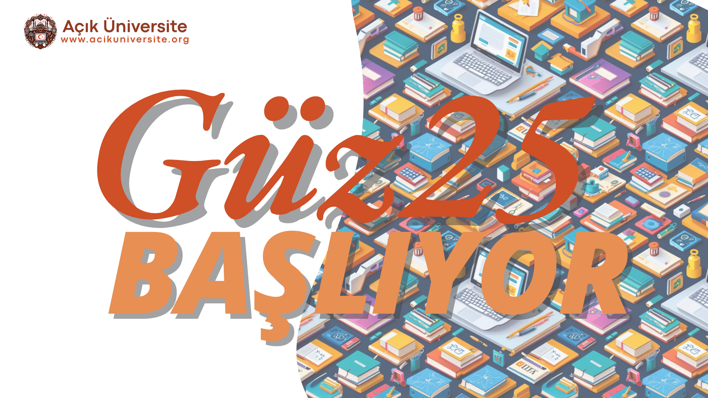

# Açık Üniversite Güz25 Dönemi

## Güz 25 Dönemi Hakkında
Açık Üniversite olarak, Güz Dönemi 2025 için çeşitli alanlarda yeni ve güncel dersler sunmaya hazırlanıyoruz. Bu dönem, teknoloji, veri bilimi, programlama ve web geliştirme gibi kritik alanlarda kendini geliştirmek isteyen öğrencilere yönelik kapsamlı bir eğitim programı sunuyoruz. Amacımız, katılımcıların bu alanlarda kariyerlerini ilerletebilmeleri ve sektörde aranan niteliklere sahip olmalarını sağlamaktır.

Güz Dönemi 2025 dersleri, gönüllü eğitmenler tarafından hazırlanmış olup, 8 haftalık interaktif ve uygulamalı bir formatta sunulacaktır. Katılımcılar, hem teorik bilgi hem de pratik projelerle gerçek dünya tecrübesi kazanacaklar.

Derslerin açılması için **minimum kontenjan** belirlemiş bulunmaktayız. Talebin yetersiz olduğunu düşündüğümüz dersler açılmayacaktır.

Aşağıda, bu dönemde sunulacak derslerin detaylarını bulabilirsiniz.
## Güz25 Dönem Dersleri
### 📊 Data101

**Data101**, veri alanında kariyer yapmak isteyenler için tasarlanmış 8 haftalık bir programdır. Bu ders, yazılım mühendislerinden veri bilimcilerine, veri mühendislerinden veritabanı yöneticilerine kadar geniş bir yelpazede çalışma düşünenlere tecrübe kazandırmayı hedefler.

**Kurs Süresi:** 8 Hafta  
**Kontenjan:** 12

---

### 🌐 Web101 (Hanımlara Özel)

**Web101**, web geliştirme alanında kariyer yapmak isteyen hanımlar için tasarlanmış 8 haftalık interaktif bir programdır. Ders, frontend geliştiricilerden UI/UX tasarımcılarına kadar geniş bir yelpazede çalışmayı düşünen kadınlara tecrübe kazandırmayı amaçlar. Ayrıca, kadınların rahat bir ortamda öğrenip proje geliştirebileceği bir ekip ortamı sağlanacaktır.

**Kurs Süresi:** 8 Hafta  
**Kontenjan:** 15
**Ek Bilgi**: Hanımlara Özeldir, Dersi Hanım bir hocamız verecektir.

---

### 🖥️ Web101 (Beylere Özel)

**Web101**, web geliştirme alanında kariyer yapmak isteyen beyler için tasarlanmış 8 haftalık interaktif bir programdır. Program, frontend geliştiricilerden full-stack yazılımcılara kadar geniş bir yelpazede çalışmayı düşünen erkeklere tecrübe kazandırmayı hedefler. HTML, CSS, JavaScript gibi temel teknolojilerle birlikte modern çerçeveler de öğretilecektir.

**Kurs Süresi:** 8 Hafta  
**Son Kayıt Tarihi:** 30 Ekim  
**Kontenjan:** 10
**Ek Bilgi**: Sadece Beylere Özeldir,

---

### 🖥️ CS101

**CS101**, bilgisayar bilimleri alanında kariyer yapmak isteyenler için tasarlanmış 8 haftalık interaktif bir programdır. Ders, yazılım mühendisliği, veri bilimi, yapay zeka ve oyun geliştirme gibi alanlarda temel bilgisayar bilimi becerileri kazandırmayı hedefler.

**Kurs Süresi:** 8 Hafta  
**Son Kayıt Tarihi:** 30 Ekim  
**Kontenjan:** 15

---

### ⚙️ Go101

**Go101**, yüksek performanslı ve verimli yazılımlar geliştirmek isteyenler için tasarlanmış 8 haftalık interaktif bir programdır. Bu ders, Google tarafından geliştirilen Go diline hakim olmayı hedefleyen yazılım geliştiricilere yöneliktir.

**Kurs Süresi:** 8 Hafta  
**Son Kayıt Tarihi:** 30 Ekim  
**Kontenjan:** 10

---

### 🛠️ e2EP (End-to-End Programlama)

**e2EP**, uçtan uca yazılım geliştirme süreçlerini öğrenmek isteyenler için tasarlanmış 3 dönemlik kapsamlı bir programdır. Bu dersin ilk döneminde, projelendirme, UI/UX tasarımı, frontend ve backend geliştirme gibi temel adımlara odaklanılır. Amacımız, bir yazılım projesinin fikir aşamasından hayata geçişine kadar tüm süreçleri anlamanızı ve yönetmenizi sağlamaktır.

**Kurs Süresi:** 3 Dönem (Her dönem 8 hafta)  
**Son Kayıt Tarihi:** 30 Ekim
**Kontenjan:** 8 kişi 
**Ek Bilgi**: Dersi alabilmek için önceden Go101, Web101 ve Cs101 derslerini almış veya bunu karşılayacak bilgiye sahip olduğunuzu bir task ile bizlere bilgilendirmiş olmalısınız. Daha önceden bu dersleri almadıysanız tecrübenizin yeterli olduğunu bildirmek için lütfen bizlerle iletişime geçiniz.

-------
## Eğitmenler

| Ders Adı               | Eğitmen                | Sosyal Ağlar                                                              |
| ---------------------- | ---------------------- | ------------------------------------------------------------------------- |
| Data101                | Alameddin Çelik        | [LinkedIn](https://tr.linkedin.com/in/alameddinc)                         |
| CS101                  | Şevket Yılmaz          | [LinkedIn](https://www.linkedin.com/in/svkylmz/)                          |
| Go101                  | Muhammed Talha ÇORBACI | [LinkedIn](https://www.linkedin.com/in/muhammed-talha-çorbaci-994068265/) |
| Web101(Hanımlara Özel) | Hiranur Sazak          | [LinkedIn](https://www.linkedin.com/in/hiranur-sazak-9a4442253/)          |
| Web101(Beylere Özel)   | Abdullah Berat Pekşen  | [LinkedIn](https://www.linkedin.com/in/abdullah-berat-pekşen-a85522257/)  |
| e2EP                   | Alameddin Çelik        | [LinkedIn](https://tr.linkedin.com/in/alameddinc)                         |

-----

## Güz Dönemi 2025’e Nasıl Katılabilirsiniz?

Güz Dönemi 2025 derslerine katılmak için son başvuru tarihi 30 Ekim'dir. Başvuru yapmadan önce, kurs gereksinimlerini inceleyebilir ve kayıt formunu doldurarak başvurunuzu tamamlayabilirsiniz. Her ders, uygulamalı projeler ve mentorluk imkanlarıyla birlikte sunulacaktır.

[Kayıt Formu için Tıklayınız:](https://forms.gle/cBupaZF1daY5XRmF6)
 https://forms.gle/cBupaZF1daY5XRmF6
